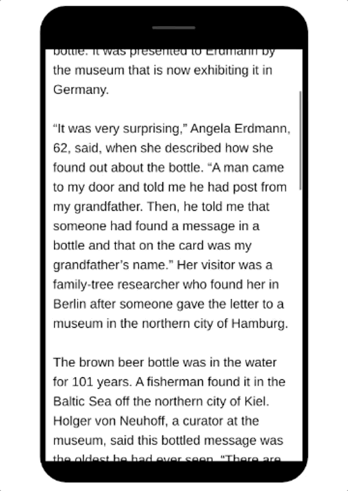
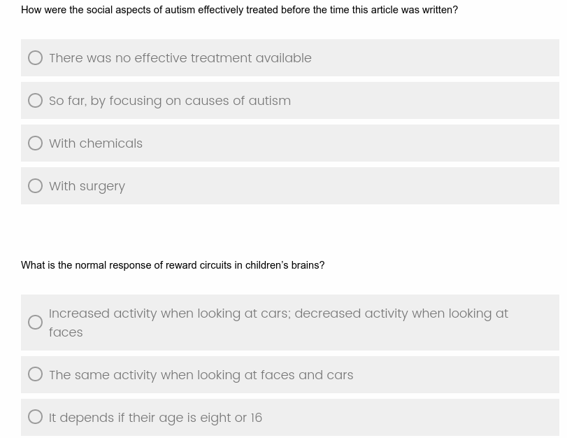

# Predicting Text Readability from Scrolling Interactions

Dataset containing scroll interactions of 598 partcipants reading advanced and elementary texts from the [OneStopEnglish corpus](https://github.com/nishkalavallabhi/OneStopEnglishCorpus). Participants answer multiple choice reading comprehension questions from [OneStopQA](https://github.com/berzak/onestop-qa). Study details and preliminary experiments can be found in [our paper](https://arxiv.org/abs/2105.06354). 

## Interface Examples

Text Interface             |  Comprehension Questions
:-------------------------:|:-------------------------:
  |  

## Participant Demographics 

| Proficiency |(%) | Education|(%) | Age range| (%)   | Hours spent reading English |(%)
| --- | ---     | --- | ---         | --- | ---      | ---  | ---   |
| Native | 46.69  | Graduate |53.67           | 18 - 24 |18.23     | 0 - 4 |24.20  |
| Near-native |14.75     | Undergraduate |39.51   | 25-34 |57.19 | 5 - 9 |22.87 |
| Advanced  |27.78  | High School| 3.59   |  35-44| 13.38 | 10 - 14  |11.72|
| Intermediate  |9.83 | Vocational |2.65          | 45-54 |8.02    | 15 - 19 |7.18 |
| Beginner  |0.95 | No formal  |0.57          | 55+ |3.17   | 20 + |33.84|

## Data Description
| Columns (elementary / advanced)         | Example                  | Description                                                                                                                                                                                          |
|-----------------------------------------|--------------------------|------------------------------------------------------------------------------------------------------------------------------------------------------------------------------------------------------|
| elementary_text                         | WNL Rwanda-ele.txt       | Title of the text shown to the participant as named in the [OneStopEnglish corpus](https://github.com/nishkalavallabhi/OneStopEnglishCorpus)                                                                                                                                                          |
| elementary_read                         | read                     | Value indicating whether it is likely the article was read from the number of scrolls                                                                                                         |
| elementary_reading_time_ms              | 92909                    | Total time spent reading the article in ms                                                                                                                                                          |
| elementary_reading_event_ms             | ['15', '5408', '6122' …] | Elapsed time for a scroll event, in the example the first scroll action occurs after 15ms and the second after 5408 ms                                                                                               |
| elementary_reading_scroll_event         | ['0', '200', '500' … ]   | Y axis distance from the start of the article, in the example the first scroll action moves the text 200px from the top of the article                                                             |
| elementary_reading_paragraph_visibility | ['0_100,1_47', '0_53…]   | Percentage of paragraphs visible whilst reading, in the example paragraph 0 is 100% visible and paragraph 1 is 47% visible then as scrolling occurs paragraph 0 is 53% visible                    |
| elementary_reading_span                 | ['A1_97', 'A1_100…]      | Shows the percentage of the distractor / answer spans that were visible to the participant. The example shows that the first comprehension question is 97% visible and then becomes fully visible (100%) as scrolling occurs   |

## Citation

@inproceedings{gooding-etal-2021-predicting,
    title = "Predicting Text Readability from Scrolling Interactions",
    author = "Gooding, Sian  and
      Berzak, Yevgeni  and
      Mak, Tony  and
      Sharifi, Matt",
    booktitle = "Proceedings of the 25th Conference on Computational Natural Language Learning",
    month = nov,
    year = "2021",
    address = "Online",
    publisher = "Association for Computational Linguistics",
    url = "https://aclanthology.org/2021.conll-1.30",
    pages = "380--390"}

