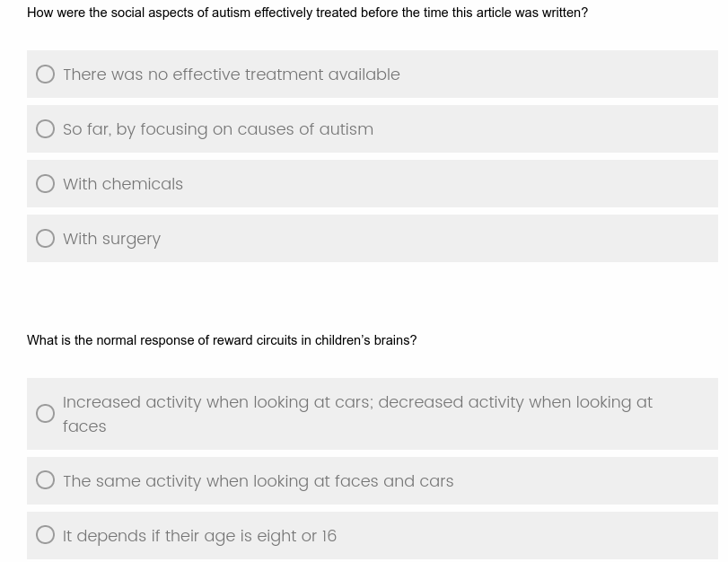

# Predicting Text Readability from Scrolling Interactions

Dataset containing scroll interactions of 598 partcipants reading advanced and elementary texts from the [OneStopEnglish corpus](https://github.com/nishkalavallabhi/OneStopEnglishCorpus). Participants answer multiple choice reading comprehension questions from [OneStopQA](https://github.com/berzak/onestop-qa). Study details and preliminary experiments can be found in [our paper](https://arxiv.org/abs/2105.06354). 

## Interface Examples

Text Interface             |  Comprehension Questions
:-------------------------:|:-------------------------:
  |  

## Participant Demographics 

| Proficiency |(%) | Education|(%) | Age range| (%)   | Hours spent reading English |(%)
| --- | ---     | --- | ---         | --- | ---      | ---  | ---   |
| Native | 46.69  | Graduate |53.67           | 18 - 24 |18.23     | 0 - 4 |24.20  |
| Near-native |14.75     | Undergraduate |39.51   | 25-34 |57.19 | 5 - 9 |22.87 |
| Advanced  |27.78  | High School| 3.59   |  35-44| 13.38 | 10 - 14  |11.72|
| Intermediate  |9.83 | Vocational |2.65          | 45-54 |8.02    | 15 - 19 |7.18 |
| Beginner  |0.95 | No formal  |0.57          | 55+ |3.17   | 20 + |33.84|

## Data Description
p_age	p_other_language	p_proficiency	p_hours_reading	p_education_lvl	elementary_text	elementary_read_value	advanced_text	advanced_read_value	elementary_reading_time_ms	advanced_reading_time_ms	elementary_reading_event_ms	advanced_reading_event_ms	elementary_reading_scroll_event	advanced_reading_scroll_event	elementary_reading_paragraph_visibility	advanced_reading_paragraph_visibility	elementary_reading_span_visibility	advanced_reading_span_visibility	elementary_question_time_ms	advanced_question_time_ms	elementary_question_event_ms	advanced_question_event_ms	elementary_question_scroll_event	advanced_question_scroll_event	elementary_question_paragraph_visibility	advanced_question_paragraph_visibility	elementary_question_span_visibility	advanced_question_span_visibility	elementary_score	advanced_score

## Citation

TODO: Add citation

